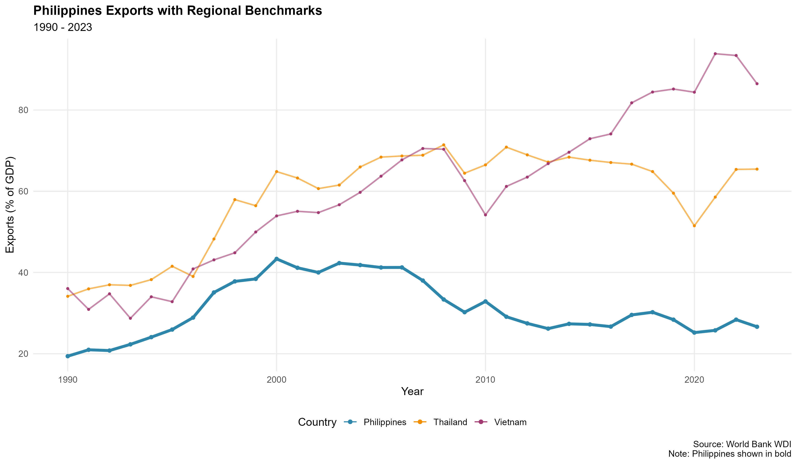
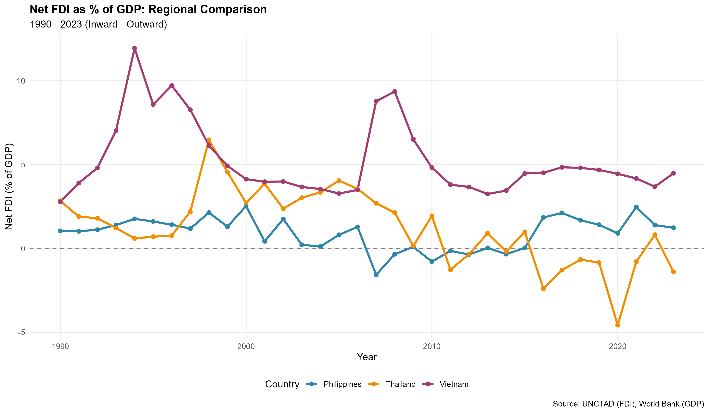

```{r setup, include=FALSE}
knitr::opts_chunk$set(
  echo = FALSE,
  warning = FALSE,
  message = FALSE,
  fig.width = 6.5,
  fig.height = 1.25,
  fig.align = 'center',
  out.width = "100%"
)

# Load required libraries
library(tidyverse)
library(here)
library(knitr)

# Set working directory to project root
here::i_am("final_report.Rmd")

# Load the combined data (in case we need it)
combined_data <- read_csv(here("data", "economic_openness_combined.csv"), 
                          show_col_types = FALSE)
```

## Introduction and Country Context
\vspace{-0.1cm}
This report compares export levels and Foreign Direct Investment (FDI) flows among the Philippines, Vietnam, and Thailand from 1990 to 2023, focusing on three demographically and economically similar Southeast Asian nations with populations ranging from 71 to 115 million and GDPs between $460 and $526 billion. While Vietnam and Thailand maintain net export surpluses, the Philippines runs a trade deficit, historically showing lower export levels (Figure 1) but successfully attracting FDI inflows particularly from 2015 to 2020 (Figure 2). The analysis reveals three distinct development trajectories: Thailand leverages established manufacturing capabilities and export infrastructure, Vietnam has rapidly transformed into an export-oriented economy with strong FDI attraction, and the Philippines pursues an alternative path focusing on services, remittances, and domestic consumption while gradually integrating into regional value chains through strategic FDI in digital sectors. Therefore, the openness among these three shows different levels been Vietnam more open to international trade, Thailand despite export relevance in GDP, does not have a surplus of inward flows like Philippines that has an economy focused on internal consumption.
```{r fig1, fig.cap="\\textbf{Figure 1:} Philippines exports with regional benchmarks (1990-2023), percentage of GDP. Source: World Bank.", fig.height=1.3}


```

```{r fig2, fig.cap="\\textbf{Figure 2:} Net FDI as percentage of GDP (1990-2023). Net FDI = inward minus outward flows. Source: UNCTAD, World Bank.", fig.height=1.3}

```

\vspace{-0.15cm}


